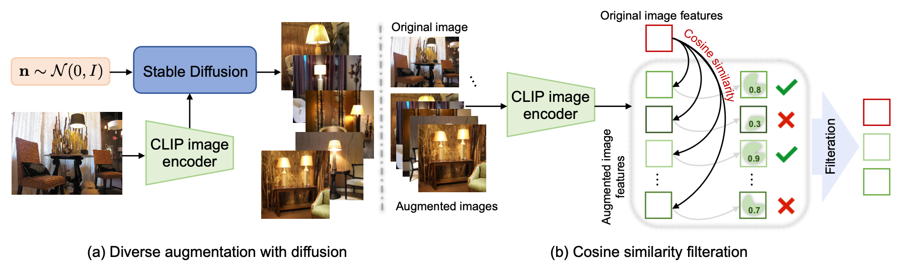

# Prompt-Learning-with-Test-Time-Adaption
Project for the 'Trends and Application of Computer Vision' course of the Master's Degree in Artificial Intelligence Systems at the University of Trento, A.Y. 2023/2024.

## Authors
- Adnan Irshad
- Hira Afzal

## Problem Statement
Recent foundation vision models like CLIP encode a wide range of visual concepts after training on millions of noisy image-text pairs and can be applied to downstream tasks in a zero-shot manner without task-specific training data. This is achieved by using prompts, which are natural language descriptions of the task, to guide the model to produce the desired output. For example, to perform zero-shot classification, we can use a prompt like "a photo of a dog" to guide the model to produce the desired output. However, in applying these models to a downstream task, heavily relies on the quality of the prompts. And prompts can be designed in different ways, like prompt engineering and hand-crafted prompts. But with the increasing number of tasks, these techniques becomes infeasible and requires lot of domain expertise. Therefore, we need to learn prompts for a given task by automating the process of prompt engineering. To address this problem, we explored different techniques to learn prompts for a given task.

## Description
This project divided into two main parts: 
1. **Prompt Learning**: In this part, we explored the different methods e.g. CoOp, CoCoOp to learn prompts for a given task using a small dataset. The details of the methods can be found in another [repository](https://github.com/MisterMandarino/Learning-Prompts-for-Transfer-Learning) by our other team members.
2. **Test-Time Adaptation**: In this part, we explored the different methods like TPT, AlignedPrompts to adapt the learned prompts at test-time to improve the performance of the model.

## Test-Time Adaptation
This repository contains the code for the test-time adaptation part of the project. CoOp applies prompt tuning to CLIP by tuning the prompt on a collection of training data which improves the CLIP’s performance on the downstream tasks but causes lacks in generalization to out-of-distribution data which then CoCoOp proposes to alleviate the problem by making the prompt conditioned on model inputs. Despite being effective on the given task, this line of work requires access to downstream training data with annotations, restricting the zero-shot knowledge transfer of foundation models. To address this problem, we explored different methods to adapt the learned prompts at test-time to improve the performance of the model.

Test-Time Adaptation (TTA) doesn't require any training data and can be applied to any model to improve ZSL performance on given task by learning prompts using target data at test-time.

 

Figure: Test-Time Adaptation

## Methodology
From part 1 of Prompt Learning, we learned prompts for a given task using a small dataset. Then, we adapted the trained model from part-1, and optimized the prompts at test-time using the target data to improve the performance of the model. We explored the following methods for test-time adaptation:

### Experiment Baselines
We did experiments on the following baselines and evaluate the performance on Cross-datasets evaluation (Oxford_Pets, Food101, CIFAR10):

#### 1. TPT + CoOP
TPT tunes prompts on the fly with a single test sample. The tuned prompt is adapted to each task on each specific test sample. TPT retains the zero-shot generalization setting since no additional training data or annotations are used. For image classification, it optimizes the prompt by minimizing the entropy with confidence selection method, leading to consistent predictions across different augmented views of each test sample. Since data is unlabelled they used unsupervised loss to compute average probability distribution as the mean of class probabilities over augmented views. Also, augmented views of an test image may lack important information needed to classify or can have noisy views, so they used a confidence selection method to select the most confident view for prompt tuning. for the further details, please refer to the [paper]((https://azshue.github.io/TPT/)).

In our project, we take the pretrained model from part-1 and apply TPT to adapt the learned prompts at test-time to improve the performance of the model.

##### TPT for image classification task 
- Pre-trained CLIP 
  - TextEncoder:
  - ImageEncode
- CoOp 
  - ClipTestTimeTuning 
  - PromptLearner
- AugMix
  - AugMixAugmenter
- tpt_classification

 

Figure: TPT for Image Classification

#### 2. DiffTPT + CoOp
DiffTPT (Diverse Data Augmentation with Diffusions for Effective Test-time Prompt Tuning) is a method that uses Diffusion models to generate diverse data augmentations for prompt tuning. It uses a diffusion model to generate diverse augmentations for each test sample and then uses these augmentations to tune the prompt. Based on our experiments with TPT method, we observed that TPT is sensitive to the quality of the augmentations and the diversity of the augmentations. Therefore, we explored DiffTPT to generate diverse augmentations for prompt tuning to improve the performance of the model. For the further details, please refer to the [paper](https://arxiv.org/abs/2308.06038).

##### DiffTPT for image classification task
- Pre-trained CLIP 
  - TextEncoder:
  - ImageEncode
- CoOp 
  - ClipTestTimeTuning 
  - PromptLearner
- AugmentationGenerator
  - StableDiffusionImageVariationPipeline
- Diff_tpt_classification

 

Figure: DiffTPT for Image Classification

#### 3. AlignedPrompts + CoOp
AlignedPrompts (Align Your Prompts: Test-Time Prompting with Distribution Alignment for Zero-Shot Generalization) is a method that aligns the prompt with the target data distribution to improve the performance of the model. It uses a distribution alignment method to align the prompt with the target data distribution. At test time, a
single test sample along with its augmented views is passed through the CLIP image encoder, and the text labels
are passed to the CLIP text encoder. The token distribution statistics – mean and variance – of the test sample
are aligned with the offline computed source data statistics using a distribution alignment loss. The resulting
alignment loss from the distribution shift is combined with the entropy loss to update the multi-modal prompts. For the further details, please refer to the [paper](https://arxiv.org/abs/2311.01459).

 

Figure: AlignedPrompts for Image Classification

### Results
#### 1. TPT + CoOp
 

Figure: TPT Performance Analysis

 

Figure: TPT Performance Analysis Over Augmentation Hyperparameters-1

 

Figure: TPT Performance Analysis Over Augmentation Hyperparameters-2

From above results, we can see that TPT improves the performance of the model on the target dataset by 5% as compared to CoOp. We also observed that TPT is sensitive to the quality of the augmentations and the diversity of the augmentations. And based on these observations, we explored DiffTPT to generate diverse augmentations for prompt tuning to improve the performance of the model.

#### 2. DiffTPT + CoOp
 

### References
- [TPT](https://azshue.github.io/TPT/)
- [DiffTPT](https://arxiv.org/abs/2308.06038)
- [AlignedPrompts](https://arxiv.org/abs/2311.01459)
- [Learning-Prompts-for-Transfer-Learning](www.github.com/MisterMandarino/Learning-Prompts-for-Transfer-Learning)
- [CLIP](www.github.com/openai/CLIP)
- [Awesome-Test-Time-Adaptation](https://github.com/tim-learn/awesome-test-time-adaptation)

